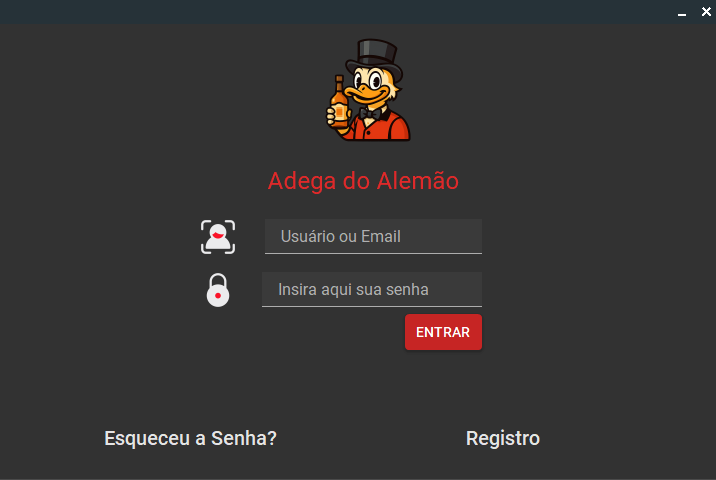
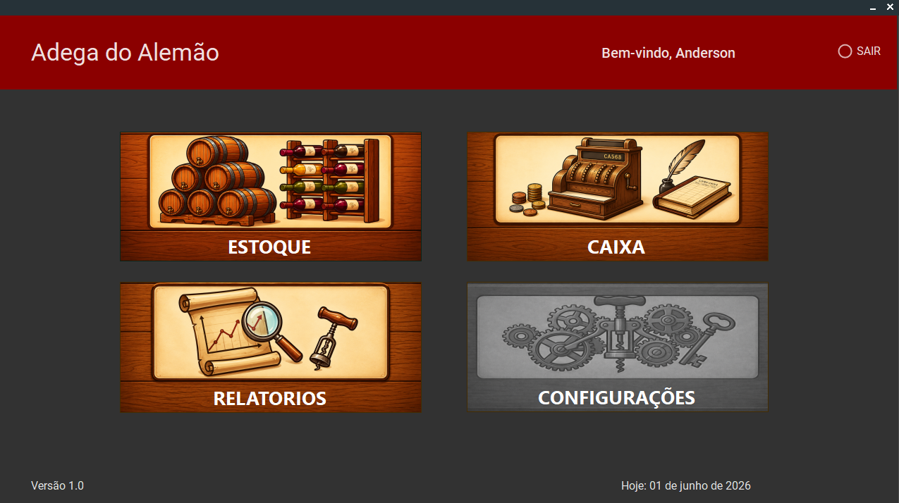
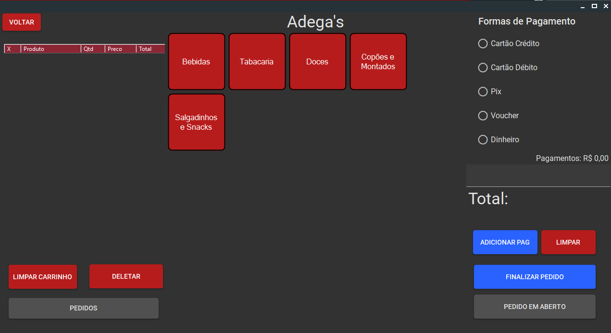
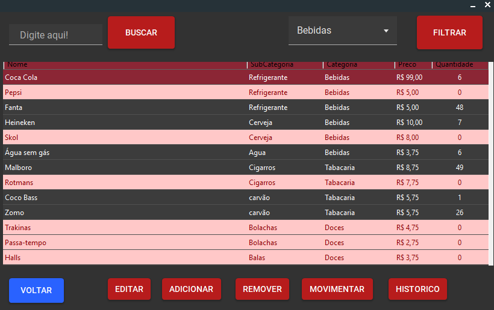
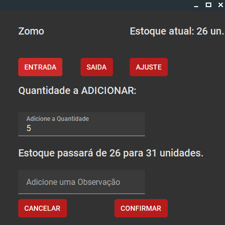
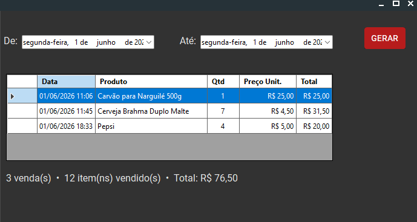

# 🍺 Projeto Integrador PDV — Adega do Alemão

> Sistema de gestão comercial desenvolvido em C# Windows Forms para controle de estoque, caixa, vendas e relatórios de uma adega.


---

## 🇧🇷 Português

### 📋 Sobre o Projeto

O **CaixaIntegrador** é um sistema desktop desenvolvido como projeto acadêmico para gerenciamento completo de uma adega. O sistema conta com módulos de autenticação, controle de estoque, frente de caixa, histórico de vendas e geração de relatórios.

---

### 🖼️ Screenshots

<table>
  <tr>
    <td align="center"><b>Login</b></td>
    <td align="center"><b>Menu Principal</b></td>
  </tr>
  <tr>
    <td></td>
    <td></td>
  </tr>
  <tr>
    <td align="center"><b>Caixa</b></td>
    <td align="center"><b>Estoque</b></td>
  </tr>
  <tr>
    <td></td>
    <td></td>
  </tr>
  <tr>
    <td align="center"><b>Movimentação de Estoque</b></td>
    <td align="center"><b>Relatório de Vendas</b></td>
  </tr>
  <tr>
    <td></td>
    <td></td>
  </tr>
</table>

---

### 🚀 Funcionalidades

#### 🔐 Autenticação
- Login e registro de usuários
- Criptografia de senha com **SHA-256**
- Validação de senha: mínimo 8 caracteres, confirmação obrigatória
- Bloqueio de e-mail duplicado no cadastro
- Recuperação de senha via **e-mail com código de verificação** (integração com API externa)
- Redefinição de senha diretamente pelo sistema após validação do código

#### 📦 Estoque
- Cadastro de produtos com categoria e subcategoria
- Edição e remoção de produtos
- Movimentação de estoque: **Entrada**, **Saída** e **Ajuste**
- Preview em tempo real da movimentação antes de confirmar
- Histórico completo de todas as movimentações
- Destaque visual (vermelho) para produtos com estoque zerado
- Filtro por categoria e busca por nome

#### 🛒 Caixa
- Frente de caixa completa com seleção por categorias
- Suporte a múltiplas formas de pagamento: Cartão Crédito, Débito, Pix, Voucher e Dinheiro
- Histórico de vendas e pedidos em aberto
- Geração de **nota fiscal** em PDF consultável no próprio sistema

#### 📊 Relatórios
- Relatório de vendas filtrado por período (data início / data fim)
- Exibição de quantidade, preço unitário e valor total por venda
- Contador de vendas e total geral no rodapé

---

### 🛠️ Tecnologias Utilizadas

| Tecnologia | Uso |
|---|---|
| C# .NET | Linguagem principal |
| Windows Forms | Interface gráfica |
| Entity Framework Core | ORM / acesso ao banco |
| SQLite | Banco de dados local |
| MaterialSkin 2 | Tema visual Material Design |
| SHA-256 | Criptografia de senhas |
| API de E-mail | Recuperação de senha via código |

---

### 📁 Estrutura do Projeto

```
CaixaIntegrador/
├── Classes/          # Modelos de dados (Produto, Venda, Usuario...)
├── Data/             # AppDbContext — configuração do banco
├── Estoque/          # Telas e lógica do módulo de estoque
├── Caixa/            # Telas e lógica do módulo de caixa
├── Relatorios/       # Geração de relatórios e PDF
├── Pagina_Inicial/   # Tela inicial, login, registro e recuperação de senha
├── screenshots/      # Capturas de tela do sistema
└── Data/Adega.db     # Banco de dados SQLite
```

---

### ⚙️ Como Executar

**Pré-requisitos:**
- Visual Studio 2022 ou superior
- .NET 6.0 ou superior
- NuGet packages: `Microsoft.EntityFrameworkCore.Sqlite`, `MaterialSkin.2`

**Passos:**
1. Clone o repositório
   ```bash
   git clone https://github.com/seu-usuario/CaixaIntegrador.git
   ```
2. Abra o arquivo `CaixaIntegrador.sln` no Visual Studio
3. Restaure os pacotes NuGet
   ```
   Tools → NuGet Package Manager → Restore
   ```
4. Certifique-se que o arquivo `Adega.db` está na pasta `Data/` dentro do diretório de saída
5. Execute com `F5`

---

### 🗄️ Banco de Dados

O sistema usa **SQLite** com arquivo local `Adega.db`. As principais tabelas são:

| Tabela | Descrição |
|---|---|
| `Produtos` | Cadastro de produtos com preço, quantidade e categoria |
| `Categorias` / `SubCategorias` | Hierarquia de categorias |
| `Vendas` | Registro de cada venda realizada |
| `MovimentacoesEstoque` | Histórico de entradas, saídas e ajustes |
| `Usuarios` | Usuários do sistema com senha em hash |

---

### 👨‍💻 Desenvolvedores

| Nome | Responsabilidade |
|---|---|
| **Anderson CL** | Módulo de estoque, relatórios, banco de dados e autenticação |
| **Victor Dennis SA** | Módulo de caixa, geração de PDF e design da interface|
| **Kathellyn Larry** | Wireframe e prototipação das telas, documentação do projeto |
| **João Carlos** | Levantamento de requisitos, testes e validação do sistema |
| **Victor Paulo** | Modelagem do banco de dados e diagramas do sistema |

---

---

## 🇺🇸 English

### 📋 About

**CaixaIntegrador** is a desktop management system built with C# Windows Forms, developed as an academic project for a beverage store. It includes modules for authentication, inventory control, point of sale, sales history, and report generation.

---

### 🖼️ Screenshots

<table>
  <tr>
    <td align="center"><b>Login</b></td>
    <td align="center"><b>Main Menu</b></td>
  </tr>
  <tr>
    <td></td>
    <td></td>
  </tr>
  <tr>
    <td align="center"><b>Point of Sale</b></td>
    <td align="center"><b>Inventory</b></td>
  </tr>
  <tr>
    <td></td>
    <td></td>
  </tr>
  <tr>
    <td align="center"><b>Stock Movement</b></td>
    <td align="center"><b>Sales Report</b></td>
  </tr>
  <tr>
    <td></td>
    <td></td>
  </tr>
</table>

---

### 🚀 Features

#### 🔐 Authentication
- User login and registration
- Password encryption with **SHA-256**
- Password validation: minimum 8 characters, confirmation required
- Duplicate email prevention
- Password recovery via **email verification code** (external API integration)
- Password reset directly in the system after code validation

#### 📦 Inventory
- Product registration with category and subcategory
- Edit and remove products
- Stock movements: **Entry**, **Exit** and **Adjustment**
- Real-time preview before confirming a movement
- Full movement history
- Visual highlight (red) for out-of-stock products
- Filter by category and search by name

#### 🛒 Point of Sale
- Full cashier interface with category-based product selection
- Multiple payment methods: Credit Card, Debit Card, Pix, Voucher and Cash
- Sales history and open orders
- **Invoice** generation as PDF, viewable inside the system

#### 📊 Reports
- Sales report filtered by date range
- Displays quantity, unit price and total value per sale
- Sales count and grand total summary at the bottom

---

### 🛠️ Tech Stack

| Technology | Usage |
|---|---|
| C# .NET | Main language |
| Windows Forms | UI framework |
| Entity Framework Core | ORM / database access |
| SQLite | Local database |
| MaterialSkin 2 | Material Design theme |
| SHA-256 | Password hashing |
| Email API | Password recovery via code |

---

### ⚙️ How to Run

**Requirements:**
- Visual Studio 2022 or later
- .NET 6.0 or later
- NuGet packages: `Microsoft.EntityFrameworkCore.Sqlite`, `MaterialSkin.2`

**Steps:**
1. Clone the repository
   ```bash
   git clone https://github.com/your-username/CaixaIntegrador.git
   ```
2. Open `CaixaIntegrador.sln` in Visual Studio
3. Restore NuGet packages
   ```
   Tools → NuGet Package Manager → Restore
   ```
4. Make sure `Adega.db` is inside the `Data/` folder in the output directory
5. Run with `F5`

---

### 👨‍💻 Developers

| Nome | Responsibility |
|---|---|
| **Anderson CL** | Inventory module, reports, database and authentication |
| **Victor Dennis SA** | Point of sale module, PDF generation and UI design |
| **Kathellyn Larry** | Wireframing, screen prototyping and project documentation |
| **João Carlos** | Requirements gathering, testing and system validation |
| **Victor Paulo** | Database modeling and system diagrams |

---

### 📌 Project Status


> Academic project under active development.
